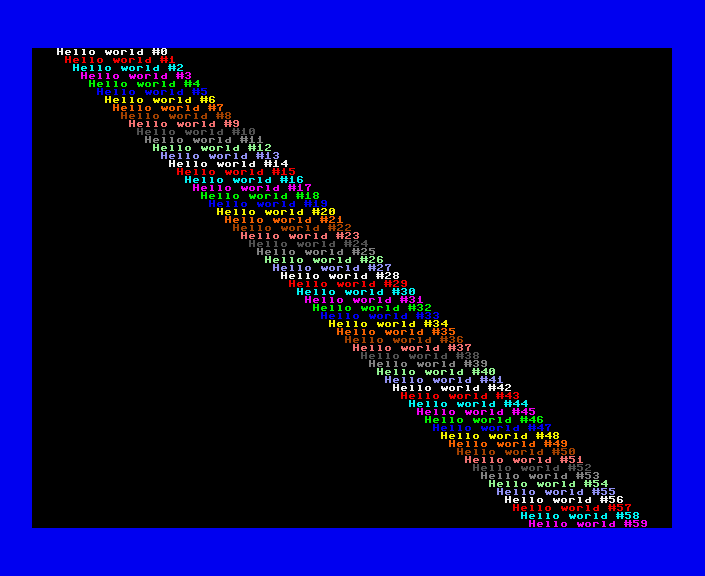
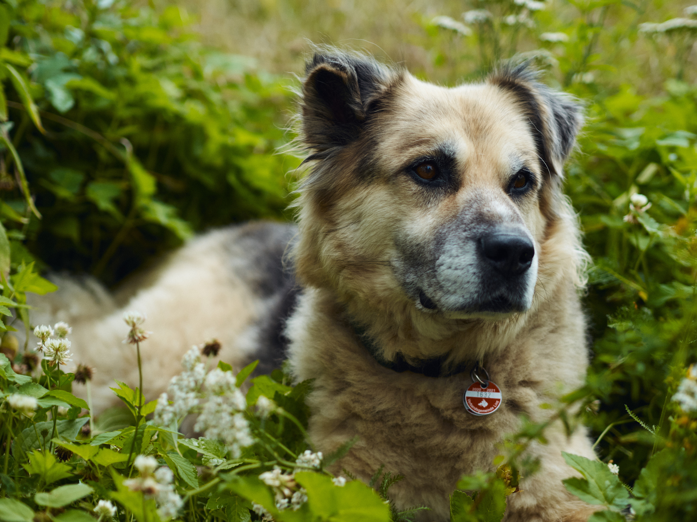
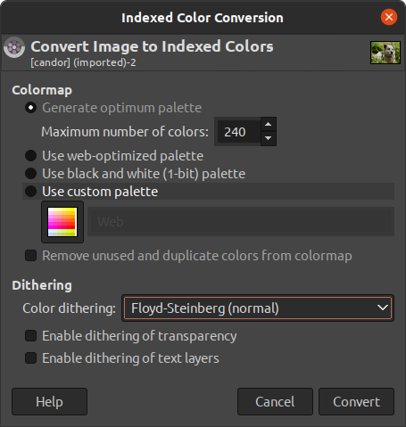
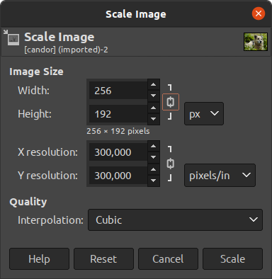

## Preface: What is FCIO?

*fcio* is a lightweight C library providing full colour mode support for C developers on the MEGA65:

- standard text input/output facilities (fc_puts, fc_printf, fc_input...)
- text window support (fc_makewin, fc_setwin...)
- dynamically loading and displaying bitmap images (fc_loadFCI, fc_displayFCI...)
- palette manipulation (fc_loadPalette, fc_setPalette, fc_fadePalette...)
- and some various other bells and whistles

Since *fcio* is now a part of [mega65-libc](https://github.com/MEGA65/mega65-libc), I figured people might be interested in how to load and display pictures and text using the fcio library. So this is a little tutorial showing how to accomplish exactly that.

## What is Full Colour Mode?

Full Colour Mode (FCM for short) is a new screen mode of the MEGA65's video controller (the VIC-IV). Full Colour Mode allows you to  mix text and 24 bit graphics on the same screen, as well as performing all kinds of neat tricks with the display, such as overlaying additional content, flipping and mirroring character cells and much more.

Since in FCM, each 8x8 pixel character cell on the screen is referenced by a 16 bit pointer, it is not compatible to 'traditional' C64 text modes and therefore not accessible via standard console libraries, such as mega65-libc's own *conio.h*. This is where *fcio* comes in.

Please note that at the moment, FCIO "only" supports displaying graphics and text, but this might very well change in the future.

# The Tutorial

## 1. Hello FCIO

Let's start with something really simple: Switching the screen to full colour mode and displaying some text. In order to do so, simply clone the mega65-libc to a convenient location, type in the following code and save it at **test.c**.

```c
#include <fcio.h>

void main() {
   fc_init(0,0,0,0,0);
   fc_puts("Hello world!");
   while(1);
}
```
Assuming you have the mega65-libc in the same folder as the test program, compile your program with

```
cl65 -Imega65-libc/cc65/include -o test test.c mega65-libc/cc65/src/fcio.c mega65-libc/cc65/src/memory.c
```

(you need to compile both `fcio.c` and `memory.c`, because `fcio.c` depends on `memory.c`. In the later stages of this tutorial, we'll use `SCons` to do the grunt work for us; but for now, calling CC65's compile and link utility `cl65` directly will suffice)

After `cl65` has done its magic, there should be a new `test` binary in your current folder. You can now transfer it to your MEGA65 using your trusty `m65` utility like so:

```
m65 -4 test -l /dev/ttyUSB2
```

or, if your MEGA65 got stuck in the mail, fire up your xemu emulator:

```
xemu-xmega65 -prg ./test
```

In any case, the result should be the same: A green 'hello world' on a black background.

<br/>

Not much to look at, you might think, but you have just successfully initialized a full colour mode screen and put some text on it. Now, let's make things a little bit more interesting, shall we?

## 2. Configuring the screen

At initialization time, there is a lot of things going on behind the scenes. 
The prototype of `fcio_init` is:

```c
void fc_init(byte h640, 
             byte v400, 
             fcioConf *config, 
             byte rows, 
             char *reservedBitmapFile);
```

So, when initializing the library with `fc_init(0,0,0,0,0)`, here is what actually happens:

- the H640 and V400 flags are set to 0, giving us a low resolution (320x200) screen.
- by passing "0" as the "config" parameter, the standard memory configuration is selected (fcio allows you to place bitmap and character data anywhere in memory, but it can also handle those things for you when you pass '0')
- by passing "0" as the "rows" parameter, a standard screen with 25 character rows is created. Unlike the C64, the MEGA65 allows arbitrary screen configurations. In PAL mode, it is possible to have up to 33 character rows in non-V400 modes
- and finally, by passing "0" as the reservedBitmapFile parameter, no reserved bitmap is loaded at initialization. Don't worry about that now, we'll be looking at reserved bitmaps later.

So, with that knowledge, it's quite easy to set up a high resolution screen with a few extra columns to play with:

```c
#include <fcio.h>
#include <conio.h>

void main() {
   byte i;
   fc_init(1,1,0,60,0);
   bordercolor(6);
   for (i=0;i<60;++i) {
      fc_textcolor(1+(i%14));
      fc_gotoxy(i,i);
      fc_printf("Hello world #%d",i);
   }
   while(1);
}
```
There are a few things noteworthy about this program:

1. We include the `conio.h` header, because we're using the `bordercolor`function to change the border colour. This shows that `conio.h` and `fcio.h` are able to coexist (in fact, some portions of `fcio.h` depend on `conio.h`). Just don't think about mixing `conio`s text output functions to display text on a full colour screen (and vice versa) – it won't work and will most probably lead to sad things™.

2. You can use `fc_printf` just like you would use the regular `printf` function. It accepts the same variable arguments and acts just like its `stdio.h` counterpart. 

Compile and link the program again. Before running it, remember to set your MEGA65 to operate in PAL mode, as NTSC mode doesn't provide quite enough resolution for a screen with 60 text rows.

Assuming all went well, you should now see something like this:

<br/>

Now we're talking! 60 rows of text in high resolution. 

To be perfectly honest, this would also have been possible with standard character mode. So, it's time we unleashed FCIOs full power by displaying some pretty bitmap graphics.

But before we can do just that, we first have to take care of getting some pretty bitmap graphics onto the MEGA65, preferrably in a form that FCIO understands.

## 3. How to get bitmap images onto the MEGA65

`fcio` internally uses an image format called `.FCI` (for *full colour image*). There is nothing magical about `.FCI` images – they just have their bitmap data arranged in a way that the VIC-IV can easily display, so `fcio` doesn't need much code to load and display them which means more real estate for your programs. 

There is a python tool `png2fci` available for converting PNG files to FCI images. It is available at https://raw.githubusercontent.com/MEGA65/mega65-tools/master/src/tools/png2fci.py. 

Before continuing with this tutorial, install `png2fci` somewhere in your `$PATH` and you're set to go.

### 3.1 Provide an indexed PNG with suitable dimensions

Since the VIC-IV is a palette based chip, we need a source image that is indexed. Furthermore, if we want to keep the 15 system colours – which we do for the time being –, we need a indexed source picture using less than 240 colours.

Fortunately, there's a wide range of software which allows us to convert about any image into the desired shape. In this tutorial, we'll use GIMP, but of course any commercial software or subscription rip-off will do just as nicely.

To get started, Let's take this JPEG image of Candor, my trusty co-developer (or really any other JPEG you want):

<br/>

Right-click on the image and save it somewhere, then open it up with GIMP. 

The first thing we have to do is to convert this image from RGB to indexed colour. So, in GIMP select "Image -> Mode -> Indexed..." in the menu, which brings up this dialog:

<br/>

Make sure that you're converting the image to a maximum of 240 colours (remember, we want to keep the system colours). Then press 'convert' to actually start the conversion.

After converting the image to indexed colour, there's one last thing we need to change: The image is way too big for displaying it on the MEGA65. Let's scale it down to a more MEGA65 friendly size by selecting "Image -> Image size" and then requesting an image size of 256x192 pixels:

<br/>